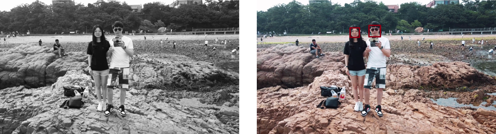
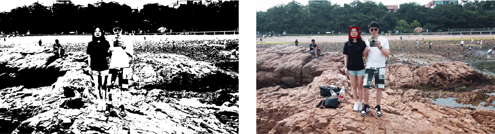

# 视频人脸检测

<center>姓名：张喆	&emsp;&emsp;&emsp;&emsp;	学号：2101212846	&emsp;&emsp;&emsp;&emsp;	指导老师：张健助理教授</center>

* [具体实现](#具体实现)
* [结果展示](#结果展示)
* [扩展分析](#扩展分析)

-----

## 具体实现

​	本实验主要分为两大模块：视频处理 + 图像人脸检测

​	图像人脸检测部分与作业二类似，依然采用OpenCV中的`detectMultiScale()方法，模型选用`haarcascade`。

​	视频处理模块代码如下：

```python
capture = cv2.VideoCapture('video/video.MOV')

width, height = int(capture.get(cv2.CAP_PROP_FRAME_WIDTH)), int(capture.get(cv2.CAP_PROP_FRAME_HEIGHT))
fourcc = cv2.VideoWriter_fourcc(*'mp4v')
writer = cv2.VideoWriter('video/output.mp4', fourcc, 25, (width, height))

if capture.isOpened():
  ret, frame = capture.read()
  else:
    ret = False

    while ret:
      detected_frame = face_detection(frame)
      writer.write(detected_frame)
      ret, frame = capture.read()

      writer.release()
```

## 结果展示

> 输出的视频通过`ffmpeg -i output.mp4 -vf scale=640:-1 output.gif`导出为gif展示


## 扩展分析

​	在初始实验时将原始帧图像转换为灰度图后就进行人脸检测，输出的结果中有较多人脸没有被很好检测，尤其是带墨镜的男生存在较多的帧未能检测。因此我又多次尝试调整了`minNeighbors`和`minSize`的阈值，过小时会有很多噪声（非人脸区域被框选），过大时女生人脸也难以被正确检测。因此又尝试了些图像处理的简单方法加以改进。

1. 高斯滤波器

```python
blur = cv2.GaussianBlur(gray, (3,3), 0)
```

​	采用高斯滤波器后图像得到一定的平滑，噪声得到一定程度的消除，从结果是品种来看效果较好



2. 阈值分割处理

```python
_, th = cv2.threshold(blur, 0, 255, cv2.THRESH_BINARY + cv2.THRESH_OTSU)
```

​	在高斯滤波基础上又采用了阈值分割处理，这里是用的是Otsu自适应阈值分割算法，但从中间输出的灰度图中可以看到人脸经过阈值处理后细节丢失了很多，可能对于检测器而言变得特征不明显，因此大量人脸无法被正确标注



​	最终本实验选择先将原图转换为灰度图后进行高斯滤波处理，处理后的图像再进行人脸检测已经能得到比较满意的效果。