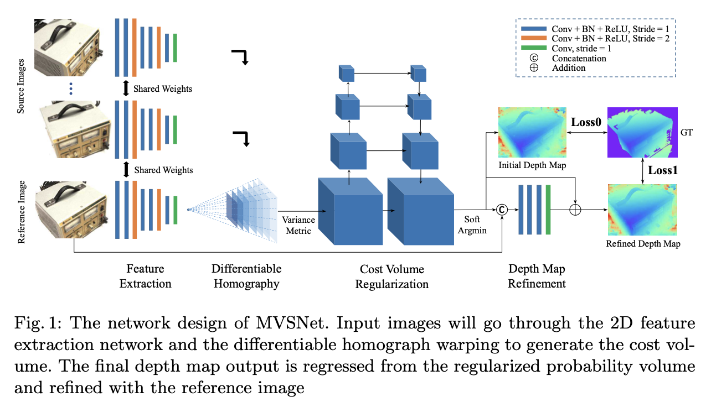
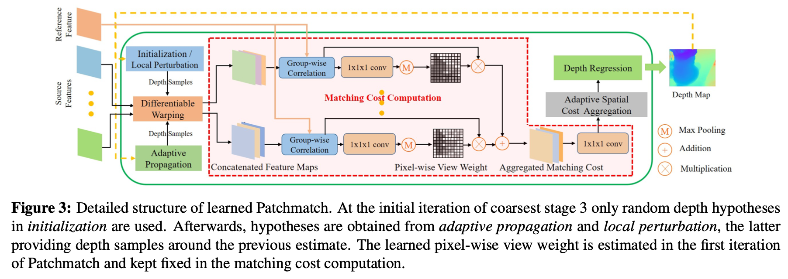
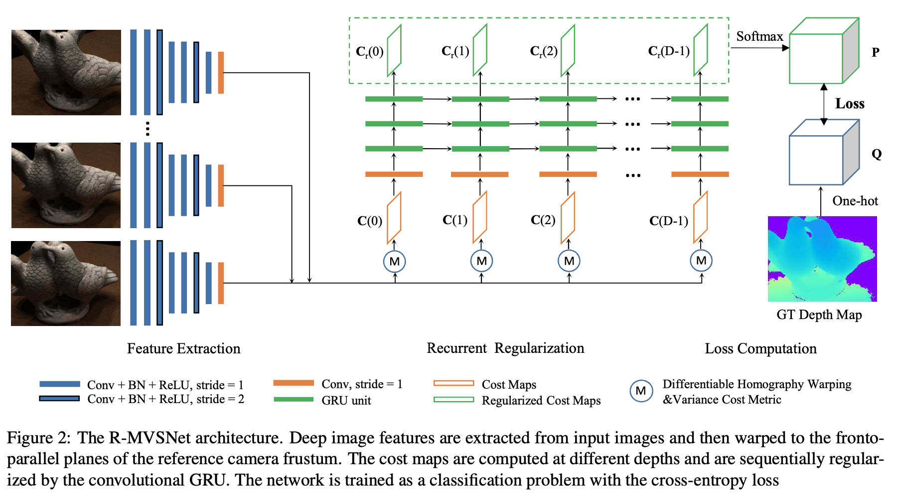
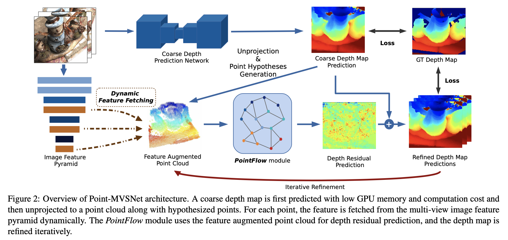
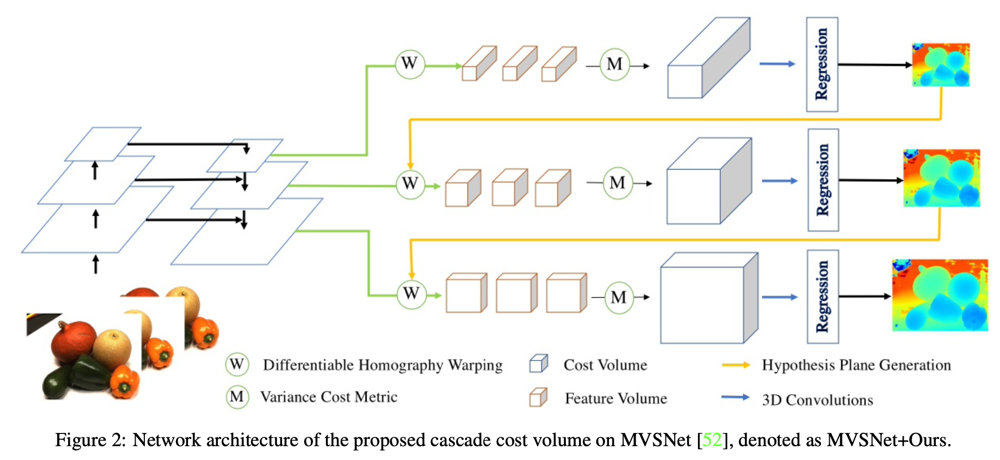
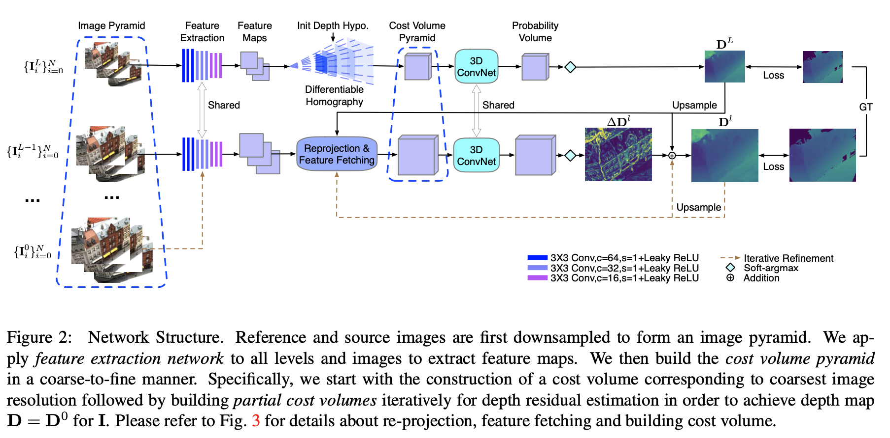
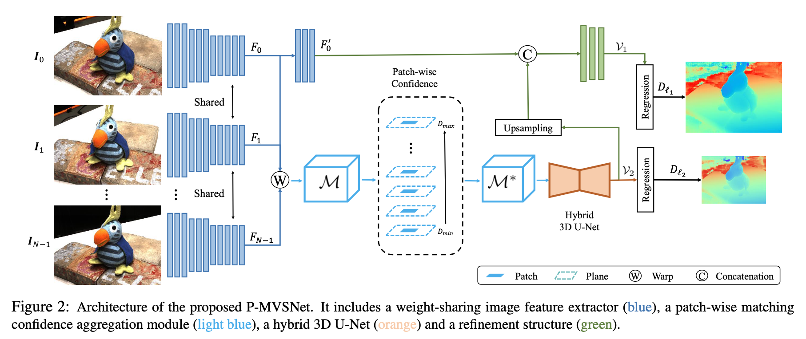
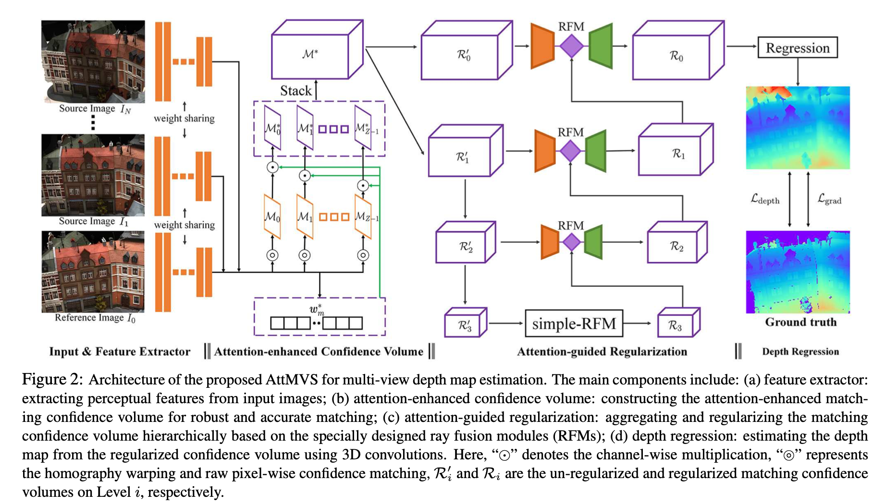

# 计算机视觉课论文列表

## 项目课题

Multi-View Stereo

 

## 论文汇总

|            | 论文题目                                                     | 出处(年份)      | 原文｜代码                                                   |
| ---------- | ------------------------------------------------------------ | --------------- | ------------------------------------------------------------ |
| [[1*]](#mvsnet) | MVSNet: Depth Inference for Unstructured Multi-view Stereo   | ECCV(2018)      | [paper](https://openaccess.thecvf.com/content_ECCV_2018/html/Yao_Yao_MVSNet_Depth_Inference_ECCV_2018_paper.html) \| [code](https://github.com/YoYo000/MVSNet) |
| [[2*]](#patchmatchnet)       | PatchmatchNet: Learned Multi-View Patchmatch Stereo          | CVPR(2021) oral | [paper](https://openaccess.thecvf.com/content/CVPR2021/html/Wang_PatchmatchNet_Learned_Multi-View_Patchmatch_Stereo_CVPR_2021_paper.html) \| [code](https://github.com/FangjinhuaWang/PatchmatchNet) |
| [[3]](#r-mvsnet)        | Recurrent MVSNet for High-resolution Multi-view Stereo Depth Inference | CVPR(2019)      | [paper](https://openaccess.thecvf.com/content_CVPR_2019/html/Yao_Recurrent_MVSNet_for_High-Resolution_Multi-View_Stereo_Depth_Inference_CVPR_2019_paper.html) \| [code](https://github.com/YoYo000/MVSNet) |
| [[4]](#point-mvs)        | Point-based multi-view stereo network                        | ICCV(2019) oral | [paper](https://openaccess.thecvf.com/content_ICCV_2019/html/Chen_Point-Based_Multi-View_Stereo_Network_ICCV_2019_paper.html) \| [code](https://github.com/callmeray/PointMVSNet) |
| [[5]](#cascade-cost-volume)        | Cascade Cost Volume for High-Resolution Multi-View Stereo and Stereo Matching | CVPR(2020) oral | [paper](https://openaccess.thecvf.com/content_CVPR_2020/html/Gu_Cascade_Cost_Volume_for_High-Resolution_Multi-View_Stereo_and_Stereo_Matching_CVPR_2020_paper.html) \| [code](https://github.com/alibaba/cascade-stereo) |
| [[6]](#cost-volume-pyramid)        | Cost Volume Pyramid Based Depth Inference for Multi-View Stereo | CVPR(2020) oral | [paper](https://openaccess.thecvf.com/content_CVPR_2020/html/Yang_Cost_Volume_Pyramid_Based_Depth_Inference_for_Multi-View_Stereo_CVPR_2020_paper.html) \| [code](https://github.com/JiayuYANG/CVP-MVSNet) |
| [[7]](#p-mvsnet)        | P-MVSNet: Learning Patch-wise Matching Confidence Aggregation for Multi-View Stereo | ICCV(2019)      | [paper](https://openaccess.thecvf.com/content_ICCV_2019/html/Luo_P-MVSNet_Learning_Patch-Wise_Matching_Confidence_Aggregation_for_Multi-View_Stereo_ICCV_2019_paper.html) \| code |
| [[8]](#attention-aware)        | Attention-Aware Multi-View Stereo                            | CVPR(2020)      | [paper](https://openaccess.thecvf.com/content_CVPR_2020/html/Luo_Attention-Aware_Multi-View_Stereo_CVPR_2020_paper.html) \| code |

> `*`为精读文章，其余为泛读文章

 

## 精读论文

1. **<a id="mvsnet">MVSNet: Depth Inference for Unstructured Multi-view Stereo</a>**
   - **团队**：香港科技大学权龙教授团队
   - **作者**：Yao Yao,  Zixin Luo, Shiwei Li, Tian Fang, Long Quan
   - **出处**：ECCV(2018)
   - **说明**：基于深度学习的MVS问题开山之作
   - **原文及代码**：[paper](https://openaccess.thecvf.com/content_ECCV_2018/html/Yao_Yao_MVSNet_Depth_Inference_ECCV_2018_paper.html) \| [code](https://github.com/YoYo000/MVSNet)

2. **<a id="patchmatchnet">PatchmatchNet: Learned Multi-View Patchmatch Stereo**</a>
    - **团队**：苏黎世联邦理工学院
    - **作者**：Fangjinhua Wang, Silvano Galliani, Christoph Vogel, Pablo Speciale, Marc Pollefeys
    - **出处**：CVPR(2021) oral
    - **原文及代码**：[paper](https://openaccess.thecvf.com/content/CVPR2021/html/Wang_PatchmatchNet_Learned_Multi-View_Patchmatch_Stereo_CVPR_2021_paper.html) \| [code](https://github.com/FangjinhuaWang/PatchmatchNet)

 

## 泛读论文

3. <a id="r-mvsnet">Recurrent MVSNet for High-resolution Multi-view Stereo Depth Inference</a>

   CVPR(2019) [paper](https://openaccess.thecvf.com/content_CVPR_2019/html/Yao_Recurrent_MVSNet_for_High-Resolution_Multi-View_Stereo_Depth_Inference_CVPR_2019_paper.html) \| [code](https://github.com/YoYo000/MVSNet)

   

   
详细信息

   Yao Yao, Zixin Luo, Shiwei Li, Tianwei Shen, Tian Fang, Long Quan

   香港科技大学权龙教授团队(与MVSNet出自同手，二者共享代码仓库)

   

   

4. <a id="point-mvs">Point-based multi-view stereo network</a>

    ICCV(2019) oral [paper](https://openaccess.thecvf.com/content_ICCV_2019/html/Chen_Point-Based_Multi-View_Stereo_Network_ICCV_2019_paper.html) \| [code](https://github.com/callmeray/PointMVSNet)

   

   
详细信息

   Rui Chen, Songfang Han, Jing Xu, Hao Su(清华大学，香港科技大学)

    

    

5. <a id="cascade-cost-volume">Cascade Cost Volume for High-Resolution Multi-View Stereo and Stereo Matching</a>

    CVPR(2020) oral [paper](https://openaccess.thecvf.com/content_CVPR_2020/html/Gu_Cascade_Cost_Volume_for_High-Resolution_Multi-View_Stereo_and_Stereo_Matching_CVPR_2020_paper.html) \| [code](https://github.com/alibaba/cascade-stereo)

   

   
详细信息

    Xiaodong Gu, Zhiwen Fan, Siyu Zhu, Zuozhuo Dai, Feitong Tan, Ping Tan(阿里巴巴AI Lab) 

    

    

6. <a id="cost-volume-pyramid">Cost Volume Pyramid Based Depth Inference for Multi-View Stereo</a>

    CVPR(2020) oral [paper](https://openaccess.thecvf.com/content_CVPR_2020/html/Yang_Cost_Volume_Pyramid_Based_Depth_Inference_for_Multi-View_Stereo_CVPR_2020_paper.html) \| [code](https://github.com/JiayuYANG/CVP-MVSNet)

    

   
详细信息

   Jiayu Yang, Wei Mao, Jose M. Alvarez, Miaomiao Liu(澳大利亚国立大学)

    

    

7. <a id="p-mvsnet">P-MVSNet: Learning Patch-wise Matching Confidence Aggregation for Multi-View Stereo</a>

    ICCV(2019) [paper](https://openaccess.thecvf.com/content_ICCV_2019/html/Luo_P-MVSNet_Learning_Patch-Wise_Matching_Confidence_Aggregation_for_Multi-View_Stereo_ICCV_2019_paper.html) \| code

    

   
详细信息

    Keyang Luo, Tao Guan, Lili Ju, Haipeng Huang, Yawei Luo(华中科技大学)

    

    

8. <a id="attention-aware">Attention-Aware Multi-View Stereo</a>

    CVPR(2020) [paper](https://openaccess.thecvf.com/content_CVPR_2020/html/Luo_Attention-Aware_Multi-View_Stereo_CVPR_2020_paper.html) \| code

    

   
详细信息

    Keyang Luo, Tao Guan, Lili Ju, Yuesong Wang, Zhuo Chen, Yawei Luo(华中科技大学)

    

    

 

## 关于作者

- **姓名**：张喆
- **学号**：2101212846
- **学院**：北京大学信息工程学院
- **课程**：计算机视觉(04711432)
- **指导老师**：[张健助理教授](http://www.ece.pku.edu.cn/info/1012/1075.htm)
- **联系方式**：[doublez@stu.pku.edu.cn](mailto:doublez@stu.pku.edu.cn)

