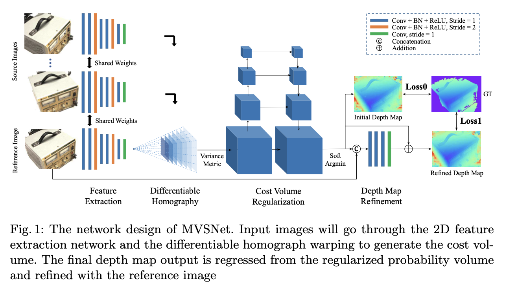
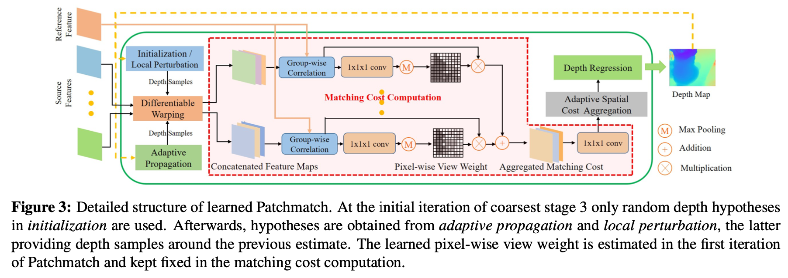
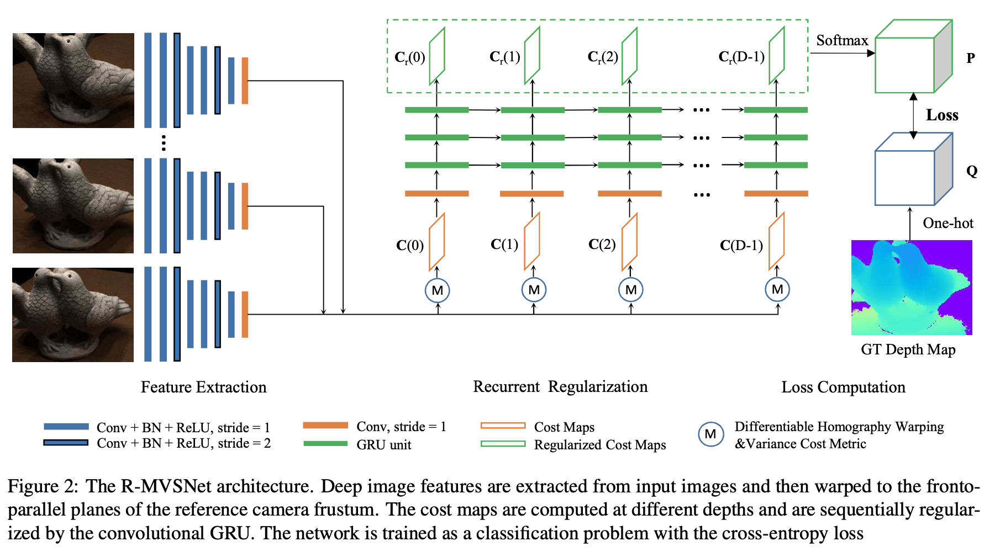
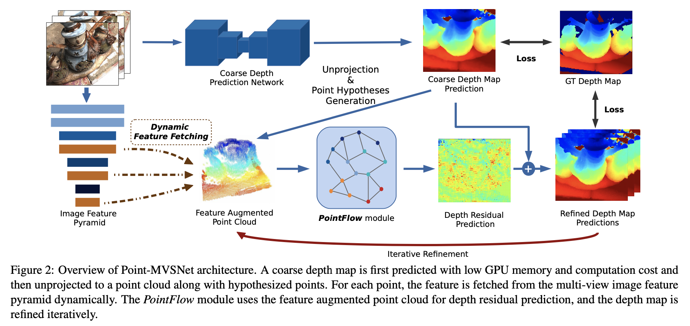
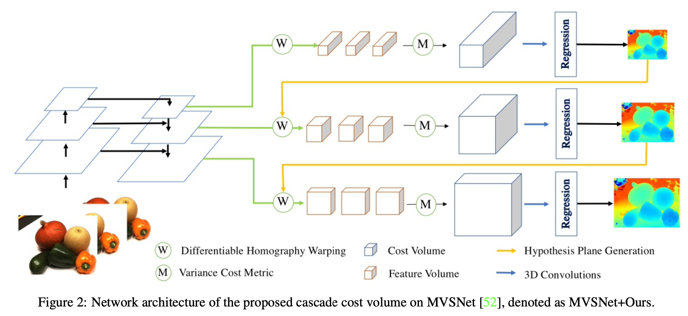
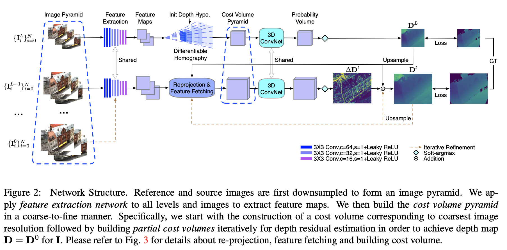
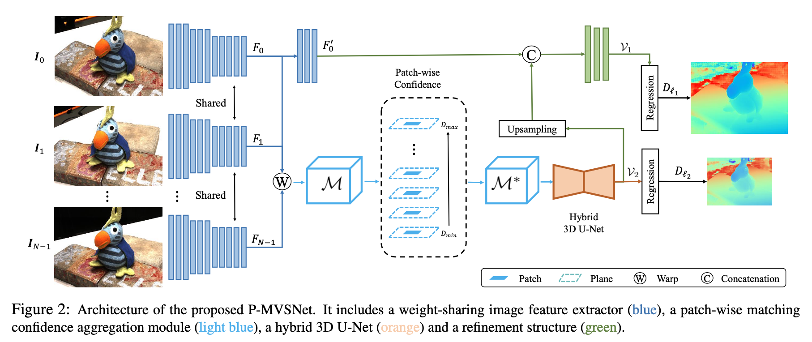
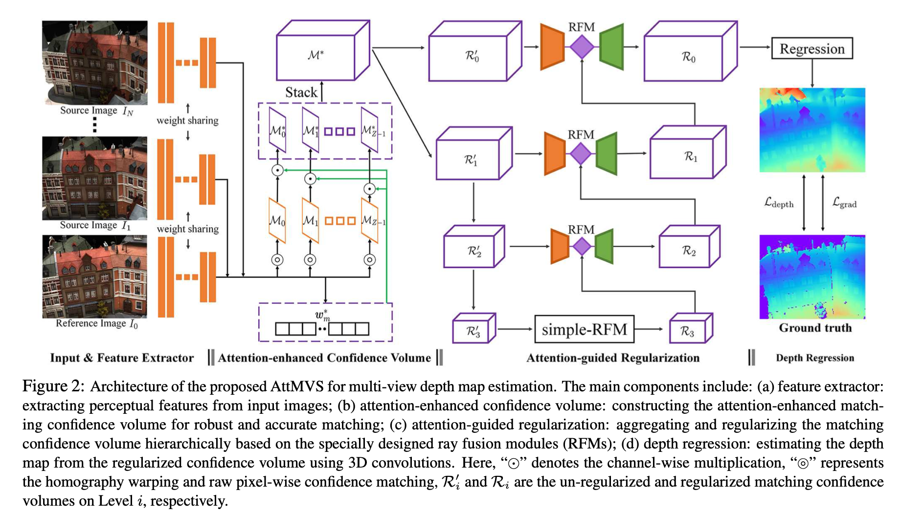

# 计算机视觉课论文列表

## 项目课题

Multi-View Stereo

## 论文汇总

|            | 论文题目                                                     | 出处(年份)      | 原文｜代码                                                   |
| ---------- | ------------------------------------------------------------ | --------------- | ------------------------------------------------------------ |
| [[1*]](#mvsnet) | MVSNet: Depth Inference for Unstructured Multi-view Stereo   | ECCV(2018)      | [paper](https://openaccess.thecvf.com/content_ECCV_2018/html/Yao_Yao_MVSNet_Depth_Inference_ECCV_2018_paper.html) \| [code](https://github.com/YoYo000/MVSNet) |
| [[2*]](#patchmatchnet)       | PatchmatchNet: Learned Multi-View Patchmatch Stereo          | CVPR(2021) oral | [paper](https://openaccess.thecvf.com/content/CVPR2021/html/Wang_PatchmatchNet_Learned_Multi-View_Patchmatch_Stereo_CVPR_2021_paper.html) \| [code](https://github.com/FangjinhuaWang/PatchmatchNet) |
| [[3]](#r-mvsnet)        | Recurrent MVSNet for High-resolution Multi-view Stereo Depth Inference | CVPR(2019)      | [paper](https://openaccess.thecvf.com/content_CVPR_2019/html/Yao_Recurrent_MVSNet_for_High-Resolution_Multi-View_Stereo_Depth_Inference_CVPR_2019_paper.html) \| [code](https://github.com/YoYo000/MVSNet) |
| [[4]](#point-mvs)        | Point-based multi-view stereo network                        | ICCV(2019) oral | [paper](https://openaccess.thecvf.com/content_ICCV_2019/html/Chen_Point-Based_Multi-View_Stereo_Network_ICCV_2019_paper.html) \| [code](https://github.com/callmeray/PointMVSNet) |
| [[5]](#cascade-cost-volume)        | Cascade Cost Volume for High-Resolution Multi-View Stereo and Stereo Matching | CVPR(2020) oral | [paper](https://openaccess.thecvf.com/content_CVPR_2020/html/Gu_Cascade_Cost_Volume_for_High-Resolution_Multi-View_Stereo_and_Stereo_Matching_CVPR_2020_paper.html) \| [code](https://github.com/alibaba/cascade-stereo) |
| [[6]](#cost-volume-pyramid)        | Cost Volume Pyramid Based Depth Inference for Multi-View Stereo | CVPR(2020) oral | [paper](https://openaccess.thecvf.com/content_CVPR_2020/html/Yang_Cost_Volume_Pyramid_Based_Depth_Inference_for_Multi-View_Stereo_CVPR_2020_paper.html) \| [code](https://github.com/JiayuYANG/CVP-MVSNet) |
| [[7]](#p-mvsnet)        | P-MVSNet: Learning Patch-wise Matching Confidence Aggregation for Multi-View Stereo | ICCV(2019)      | [paper](https://openaccess.thecvf.com/content_ICCV_2019/html/Luo_P-MVSNet_Learning_Patch-Wise_Matching_Confidence_Aggregation_for_Multi-View_Stereo_ICCV_2019_paper.html) \| code |
| [[8]](#attention-aware)        | Attention-Aware Multi-View Stereo                            | CVPR(2020)      | [paper](https://openaccess.thecvf.com/content_CVPR_2020/html/Luo_Attention-Aware_Multi-View_Stereo_CVPR_2020_paper.html) \| code |

> `*`为精读文章，其余为泛读文章

 

## 精读论文

**<a id="mvsnet">[1]</a> MVSNet: Depth Inference for Unstructured Multi-view Stereo**

- **团队**：香港科技大学权龙教授团队
- **作者**：Yao Yao,  Zixin Luo, Shiwei Li, Tian Fang, Long Quan
- **出处**：ECCV(2018)
- **说明**：基于深度学习的MVS问题开山之作
- **原文及代码**：[paper](https://openaccess.thecvf.com/content_ECCV_2018/html/Yao_Yao_MVSNet_Depth_Inference_ECCV_2018_paper.html) \| [code](https://github.com/YoYo000/MVSNet)

**<a id="patchmatchnet">[2]</a> PatchmatchNet: Learned Multi-View Patchmatch Stereo**

- **团队**：苏黎世联邦理工学院
- **作者**：Fangjinhua Wang, Silvano Galliani, Christoph Vogel, Pablo Speciale, Marc Pollefeys
- **出处**：CVPR(2021) oral
- **原文及代码**：[paper](https://openaccess.thecvf.com/content/CVPR2021/html/Wang_PatchmatchNet_Learned_Multi-View_Patchmatch_Stereo_CVPR_2021_paper.html) \| [code](https://github.com/FangjinhuaWang/PatchmatchNet)

## 泛读论文

<a id="r-mvsnet">[3]</a> Recurrent MVSNet for High-resolution Multi-view Stereo Depth Inference

 

   
详细信息

- **团队**：香港科技大学权龙教授团队
- **作者**：Yao Yao, Zixin Luo, Shiwei Li, Tianwei Shen, Tian Fang, Long Quan
- **出处**：CVPR(2019)
- **说明**：与MVSNet出自同手，二者共享代码仓库
- **原文及代码**：[paper](https://openaccess.thecvf.com/content_CVPR_2019/html/Yao_Recurrent_MVSNet_for_High-Resolution_Multi-View_Stereo_Depth_Inference_CVPR_2019_paper.html) \| [code](https://github.com/YoYo000/MVSNet)

<a id="point-mvs">[4]</a> Point-based multi-view stereo network

 

   
详细信息

- **团队**：清华大学，香港科技大学
- **作者**：Rui Chen, Songfang Han, Jing Xu, Hao Su
- **出处**：ICCV(2019) oral
- **原文及代码**：[paper](https://openaccess.thecvf.com/content_ICCV_2019/html/Chen_Point-Based_Multi-View_Stereo_Network_ICCV_2019_paper.html) \| [code](https://github.com/callmeray/PointMVSNet)

<a id="cascade-cost-volume">[5]</a> Cascade Cost Volume for High-Resolution Multi-View Stereo and Stereo Matching

 

   
详细信息

- **团队**：阿里巴巴AI Lab
- **作者**：Xiaodong Gu, Zhiwen Fan, Siyu Zhu, Zuozhuo Dai, Feitong Tan, Ping Tan
- **出处**：CVPR(2020) oral
- **原文及代码**：[paper](https://openaccess.thecvf.com/content_CVPR_2020/html/Gu_Cascade_Cost_Volume_for_High-Resolution_Multi-View_Stereo_and_Stereo_Matching_CVPR_2020_paper.html) \| [code](https://github.com/alibaba/cascade-stereo)

<a id="cost-volume-pyramid">[6]</a> Cost Volume Pyramid Based Depth Inference for Multi-View Stereo

 

   
详细信息

- **团队**：澳大利亚国立大学
- **作者**：Jiayu Yang, Wei Mao, Jose M. Alvarez, Miaomiao Liu
- **出处**：CVPR(2020) oral
- **说明**：
- **原文及代码**：[paper](https://openaccess.thecvf.com/content_CVPR_2020/html/Yang_Cost_Volume_Pyramid_Based_Depth_Inference_for_Multi-View_Stereo_CVPR_2020_paper.html) \| [code](https://github.com/JiayuYANG/CVP-MVSNet)

<a id="p-mvsnet">[7]</a> P-MVSNet: Learning Patch-wise Matching Confidence Aggregation for Multi-View Stereo

 

   
详细信息

- **团队**：华中科技大学
- **作者**：Keyang Luo, Tao Guan, Lili Ju, Haipeng Huang, Yawei Luo
- **出处**：ICCV(2019)
- **原文及代码**：[paper](https://openaccess.thecvf.com/content_ICCV_2019/html/Luo_P-MVSNet_Learning_Patch-Wise_Matching_Confidence_Aggregation_for_Multi-View_Stereo_ICCV_2019_paper.html) \| code

<a id="attention-aware">[8]</a> Attention-Aware Multi-View Stereo

 

   
详细信息

- **团队**：华中科技大学
- **作者**：Keyang Luo, Tao Guan, Lili Ju, Yuesong Wang, Zhuo Chen, Yawei Luo
- **出处**：CVPR(2020)
- **原文及代码**：[paper](https://openaccess.thecvf.com/content_CVPR_2020/html/Luo_Attention-Aware_Multi-View_Stereo_CVPR_2020_paper.html) \| code

## 关于作者

